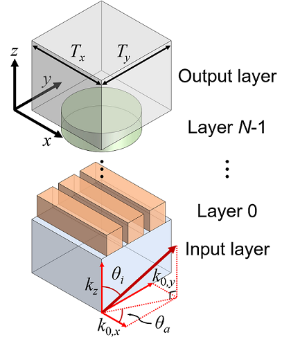
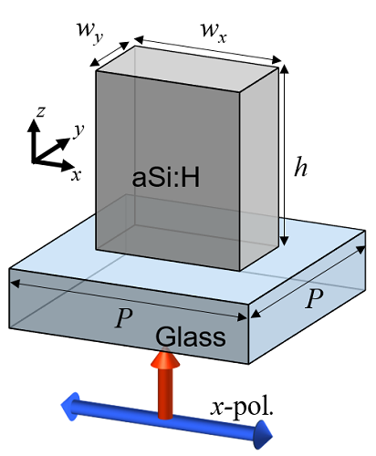

**torcwa-0.1.4.2**
======

* License: LGPL

* User guide: [Link](./docs/TORCWA_User_Guide_ver_0.1.0.pdf)

<br/>

Features
--------
**torcwa** (**torc**h + **rcwa**) is a PyTorch implementation of rigorous coupled-wave analysis (RCWA)

* **GPU-accelerated** simulation

* Supporting **automatic differentiation** for optimization

* Units: Lorentz-Heaviside units

	* Speed of light: 1

	* Permittivity and permeability of vacuum: both 1

* Notation: exp(-*jωt*)

<br/>

Citation
--------
```
@article{
	title = {TORCWA: GPU-accelerated Fourier modal method and gradient-based optimization for metasurface design},
	journal = {Computer Physics Communications},
	volume = {282},
	pages = {108552},
	year = {2023},
	doi = {https://doi.org/10.1016/j.cpc.2022.108552},
	author = {Changhyun Kim and Byoungho Lee},
}
```

<br/>

Installation
------------
* Requirements

	* Python version 3.8 or higher

	* PyTorch version 1.10.1 or higher

	* For GPU operation, GPUs that support CUDA operations

* After installing the above requirement, run the following command at the command prompt.
```
$ pip install torcwa
```
* If the PyTorch version is lower than the required, it will automatically install PyTorch 1.10.1 or higher, but the CPU-only PyTorch or incompatible version may be installed. Therefore, **before installing using the above command, please install PyTorch version that is compatible with GPU**.

<br/>

Updated features in 0.1.4
------------
1. For S-parameters and sources, p-pol. and s-pol. notation is also available.
   - There may be unexpected bugs. If S-paramter is greatly different when comparing with other simulations, or if there are other bugs, please report on issue tap or contact us.

2. When calculating the gradient of eigendecomposition, the default value of the broadening parameter (related to stabilization) is changed to 10^-10.

3. Class 'geometry' is added and have grid number and lattice constant as instance variables.
   - 'rcwa_geo' uses class variables and class methods, and will be removed in a future version.

4. Minor bugs are fixed in version 0.1.4.2


<br/>

TORCWA Examples
---------------
1. [Example 0](./example/Example0.ipynb): Fresnel equation

2. [Example 1](./example/Example1.ipynb): Simulation with rectangular meta-atom  
Normal incidence / Parametric sweep on wavelength / View electromagnetic field

3. [Example 1-1](./example/Example1-1.ipynb): Simulation with stacked meta-atom  
Normal incidence / View electromagnetic field

4. [Example 2](./example/Example2.ipynb): Simulation with square meta-atom  
Oblique incidence / View electromagnetic field

5. [Example 3](./example/Example3.ipynb): Simulation with rectangular meta-atom  
Normal incidence / Parametric sweep on geometric parameters

6. [Example 4](./example/Example4.ipynb): Gradient calculation of cylindrical meta-atom  
Differentiation of transmittance with respect to radius

7. [Example 5](./example/Example5.ipynb): Shape optimization  
Maximize anisotropy

8. [Example 6](./example/Example6.ipynb): Topology optimization  
Maximize 1st order diffraction

<br/>

Simulation - Example 1
----------------------------



<br/>

**1.** Define simulation parameters
```python
import numpy as np
import torch
from matplotlib import pyplot as plt
import scipy.io

import torcwa
import Materials

# Hardware
# If GPU support TF32 tensor core, the matmul operation is faster than FP32 but with less precision.
# If you need accurate operation, you have to disable the flag below.
torch.backends.cuda.matmul.allow_tf32 = False
sim_dtype = torch.complex64
geo_dtype = torch.float32
device = torch.device('cuda')

# Simulation environment
# light
inc_ang = 0.*(np.pi/180)    # radian
azi_ang = 0.*(np.pi/180)    # radian

# material
substrate_eps = 1.46**2

# geometry
L = [300., 300.]            # nm / nm
torcwa.rcwa_geo.Lx = L[0]
torcwa.rcwa_geo.Ly = L[1]
torcwa.rcwa_geo.nx = 300
torcwa.rcwa_geo.ny = 300
torcwa.rcwa_geo.grid()
torcwa.rcwa_geo.edge_sharpness = 1000.
torcwa.rcwa_geo.dtype = geo_dtype
torcwa.rcwa_geo.device = device
z = torch.linspace(-500,1500,501,device=device)

x_axis = torcwa.rcwa_geo.x.cpu()
y_axis = torcwa.rcwa_geo.y.cpu()
z_axis = z.cpu()

# layers
layer0_geometry = torcwa.rcwa_geo.rectangle(Wx=180.,Wy=100.,Cx=L[0]/2.,Cy=L[1]/2.)
layer0_thickness = 300.
```

* Settings

	* Only PyTorch is required to run the simulation, but other additional libraries are required for data plotting and saving. (Here, matplotlib and scipy are utilized.)

	* torch.backends.cuda.matmul.allow_tf32  
	**RTX 3090 or later models** support TF32 core operation for matrix multiplication. This is faster than the conventional computation with less accuracy. It is recommended to set to False for accurate operation.

	* sim_dtype  
	This is a data type that requires **complex number operation** and is used when declaring simulation.

	* geo_dtype  
	This is a data type that requires **real number operation** and is used when declaring geometric parameters, wavelength, and incident angles.

	* torcwa.rcwa_geo  
	If the lattice constant and sampling number are specified, basic geometry such as rectangle and circle and functions such as union and intersection can be used. The generated geometry is expressed as 1 or 0 on the grid. The edge sharpness of the geometry also can be specified. The higher this value, the sharper the edge.

<br/>

* Variables
	* inc_ang: incident angle (*θi* in above image)
	* azi_ang: azimuthal angle of incidence (*θa* in above image)
	* substrate_eps: permittivity of substrate
	* L: Lattice constant ([Tx, Ty] in above image)
	* layer0_geometry: rectangle with Wx = 180, Wy = 100
	* layer0_thickness: height of structure (h in above image)

<br/>

**2.** View internal layer geometry
```python
# View layers
plt.imshow(torch.transpose(layer0_geometry,-2,-1).cpu(),origin='lower',extent=[x_axis[0],x_axis[-1],y_axis[0],y_axis[-1]])
plt.title('Layer 0')
plt.xlim([0,L[0]])
plt.xlabel('x (nm)')
plt.ylim([0,L[1]])
plt.ylabel('y (nm)')
plt.colorbar()
```

<br/>

**3.** Generate and perform simulation (**Only get S-paramters** without electromagnetic field)
```python
order_N = 15
order = [order_N,order_N]
lamb0 = torch.linspace(400.,700.,61,dtype=geo_dtype,device=device)

txx = []
for lamb0_ind in range(len(lamb0)):
    lamb0_now = lamb0[lamb0_ind]
	# Declare simulation
    sim = torcwa.rcwa(freq=1/lamb0_now,order=order,L=L,dtype=sim_dtype,device=device)
	# Add input and output layer (This step can be skipped if both layers are free space)
    sim.add_input_layer(eps=substrate_eps)
	# Set incident angle
    sim.set_incident_angle(inc_ang=inc_ang,azi_ang=azi_ang)
	# Add internal layer
    silicon_eps = Materials.aSiH.apply(lamb0_now)**2
    layer0_eps = layer0_geometry*silicon_eps + (1.-layer0_geometry)
    sim.add_layer(thickness=layer0_thickness,eps=layer0_eps)
	# Solve global S-matrix
    sim.solve_global_smatrix()
	# Get S-parameters
    txx.append(sim.S_parameters(orders=[0,0],direction='forward',port='transmission',polarization='xx',ref_order=[0,0]))
txx = torch.cat(txx)
```

* Variables
	* order: truncated Fourier order [x-direction, y-direction]
	* lamb0: wavelength for parametric sweep

<br/>

* Sequence

	1. Declare simulation
		* freq: Frequency
		* order: Truncated Fourier order
		* L: Lattice constant
		* dtype: Simulation data type
		* device: Simulation device

	2. Add input and output layer (This step can be skipped if both layers are free space)

	3. Set incident angle
		* inc_ang: Incident angle
		* azi_ang: Azimuthal angle of incidence
		* angle_layer: Reference layer to incident and azimuthal angle (default:'input')
	
	4. Add internal layer

	5. Solve global S-matrix

	6. Get S-parameters
		* orders
		* direction (forward/backward)
		* port (transmission/reflection)
		* polarization (xx/xy/yx/yy)
		* ref_order: Reference order to calculate S-paramters

<br/>

**4.** View spectrum and export data
```python
plt.plot(lamb0.cpu(),torch.abs(txx).cpu()**2)
plt.title('Spectrum (order: '+str(order_N)+')')
plt.xlabel('Wavelength (nm)')
plt.ylabel('Transmittance (a.u.)')
plt.grid()

ex1_data = {'lamb0':lamb0.cpu().numpy(),'txx':txx.cpu().numpy()}
scipy.io.savemat('Example1_spectrum_data_order_'+str(order_N)+'.mat',ex1_data)
```

<br/>

**5.** Generate and perform simulation (Get electromagnetic field)
```python
lamb0 = torch.tensor(532.,dtype=geo_dtype,device=device)    # nm

order_N = 15
order = [order_N,order_N]
sim = torcwa.rcwa(freq=1/lamb0,order=order,L=L,dtype=sim_dtype,device=device)
sim.add_input_layer(eps=substrate_eps)
sim.set_incident_angle(inc_ang=inc_ang,azi_ang=azi_ang)
silicon_eps = Materials.aSiH.apply(lamb0)**2
layer0_eps = layer0_geometry*silicon_eps + (1.-layer0_geometry)
sim.add_layer(thickness=layer0_thickness,eps=layer0_eps)
sim.solve_global_smatrix()
# Set light source
sim.source_planewave(amplitude=[1.,0.],direction='forward')

# Get electromagnetic field
[Ex, Ey, Ez], [Hx, Hy, Hz] = sim.field_xz(torcwa.rcwa_geo.x,z,L[1]/2)
Enorm = torch.sqrt(torch.abs(Ex)**2 + torch.abs(Ey)**2 + torch.abs(Ez)**2)
Hnorm = torch.sqrt(torch.abs(Hx)**2 + torch.abs(Hy)**2 + torch.abs(Hz)**2)
```

* Sequence

	7. Set light source
		* amplitude
		* direction (forward/backward)

	8. Get electromagnetic field
		* x, y, z axis or point

<br/>

**6.** View electromagnetic field and export data
```python
fig, axes = plt.subplots(figsize=(10,12),nrows=2,ncols=4)
im0 = axes[0,0].imshow(torch.transpose(Enorm,-2,-1).cpu(),cmap='jet',origin='lower',extent=[x_axis[0],x_axis[-1],z_axis[0],z_axis[-1]])
axes[0,0].set(title='E norm',xlim=(0,L[0]),xlabel='x (nm)',ylim=(z_axis[0],z_axis[-1]),ylabel='z (nm)')
im1 = axes[0,1].imshow(torch.transpose(torch.abs(Ex),-2,-1).cpu(),cmap='jet',origin='lower',extent=[x_axis[0],x_axis[-1],z_axis[0],z_axis[-1]])
axes[0,1].set(title='Ex abs',xlim=(0,L[0]),xlabel='x (nm)',ylim=(z_axis[0],z_axis[-1]),ylabel='z (nm)')
im2 = axes[0,2].imshow(torch.transpose(torch.abs(Ey),-2,-1).cpu(),cmap='jet',origin='lower',extent=[x_axis[0],x_axis[-1],z_axis[0],z_axis[-1]])
axes[0,2].set(title='Ey abs',xlim=(0,L[0]),xlabel='x (nm)',ylim=(z_axis[0],z_axis[-1]),ylabel='z (nm)')
im3 = axes[0,3].imshow(torch.transpose(torch.abs(Ez),-2,-1).cpu(),cmap='jet',origin='lower',extent=[x_axis[0],x_axis[-1],z_axis[0],z_axis[-1]])
axes[0,3].set(title='Ez abs',xlim=(0,L[0]),xlabel='x (nm)',ylim=(z_axis[0],z_axis[-1]),ylabel='z (nm)')
im4 = axes[1,0].imshow(torch.transpose(Hnorm,-2,-1).cpu(),cmap='jet',origin='lower',extent=[x_axis[0],x_axis[-1],z_axis[0],z_axis[-1]])
axes[1,0].set(title='H norm',xlim=(0,L[0]),xlabel='x (nm)',ylim=(z_axis[0],z_axis[-1]),ylabel='z (nm)')
im5 = axes[1,1].imshow(torch.transpose(torch.abs(Hx),-2,-1).cpu(),cmap='jet',origin='lower',extent=[x_axis[0],x_axis[-1],z_axis[0],z_axis[-1]])
axes[1,1].set(title='Hx abs',xlim=(0,L[0]),xlabel='x (nm)',ylim=(z_axis[0],z_axis[-1]),ylabel='z (nm)')
im6 = axes[1,2].imshow(torch.transpose(torch.abs(Hy),-2,-1).cpu(),cmap='jet',origin='lower',extent=[x_axis[0],x_axis[-1],z_axis[0],z_axis[-1]])
axes[1,2].set(title='Hy abs',xlim=(0,L[0]),xlabel='x (nm)',ylim=(z_axis[0],z_axis[-1]),ylabel='z (nm)')
im7 = axes[1,3].imshow(torch.transpose(torch.abs(Hz),-2,-1).cpu(),cmap='jet',origin='lower',extent=[x_axis[0],x_axis[-1],z_axis[0],z_axis[-1]])
axes[1,3].set(title='Hz abs',xlim=(0,L[0]),xlabel='x (nm)',ylim=(z_axis[0],z_axis[-1]),ylabel='z (nm)')
fig.colorbar(im0,ax=axes[0,0])
fig.colorbar(im1,ax=axes[0,1])
fig.colorbar(im2,ax=axes[0,2])
fig.colorbar(im3,ax=axes[0,3])
fig.colorbar(im4,ax=axes[1,0])
fig.colorbar(im5,ax=axes[1,1])
fig.colorbar(im6,ax=axes[1,2])
fig.colorbar(im7,ax=axes[1,3])

ex1_XZ_data = {'x_axis':x_axis.numpy(),'y_axis':y_axis.numpy(),'z_axis':z_axis.numpy(),\
    'Ex':Ex.cpu().numpy(),'Ey':Ey.cpu().numpy(),'Ez':Ez.cpu().numpy(),'Enorm':Enorm.cpu().numpy(),\
    'Hx':Hx.cpu().numpy(),'Hy':Hy.cpu().numpy(),'Hz':Hz.cpu().numpy(),'Hnorm':Hnorm.cpu().numpy()}
scipy.io.savemat('Example1_XZ_data.mat',ex1_XZ_data)
```

<br/>

Optimization - Example 6
------------


**1.** Define simulation parameters
```python
import numpy as np
import torch
import scipy.io
from matplotlib import pyplot as plt
import time

import torcwa
import Materials

# Hardware
sim_dtype = torch.complex64
geo_dtype = torch.float32
device = torch.device('cuda')

# Simulation environment
# light
lamb0 = torch.tensor(532.,dtype=geo_dtype,device=device)    # nm
inc_ang = 0.*(np.pi/180)    # radian
azi_ang = 0.*(np.pi/180)    # radian

# material
substrate_eps = 1.46**2
silicon_eps = Materials.aSiH.apply(lamb0)**2

# geometry
L = [700., 300.]            # nm / nm
torcwa.rcwa_geo.Lx = L[0]
torcwa.rcwa_geo.Ly = L[1]
torcwa.rcwa_geo.nx = 700
torcwa.rcwa_geo.ny = 300
torcwa.rcwa_geo.grid()
torcwa.rcwa_geo.edge_sharpness = 1000.
torcwa.rcwa_geo.dtype = geo_dtype
torcwa.rcwa_geo.device = device

x_axis = torcwa.rcwa_geo.x.cpu()
y_axis = torcwa.rcwa_geo.y.cpu()

# layers
layer0_thickness = 300.
```

* Same as simulation example

<br/>

**2.** Define objective function
```python
def objective_function(rho):
    order = [15,8]

    sim = torcwa.rcwa(freq=1/lamb0,order=order,L=L,dtype=sim_dtype,device=device)
    sim.add_input_layer(eps=substrate_eps)
    sim.set_incident_angle(inc_ang=inc_ang,azi_ang=azi_ang)
    layer0_eps = rho*silicon_eps + (1.-rho)
    sim.add_layer(thickness=layer0_thickness,eps=layer0_eps)
    sim.solve_global_smatrix()
    t1xx = sim.S_parameters(orders=[1,0],direction='forward',port='transmission',polarization='xx',ref_order=[0,0])
    t1yy = sim.S_parameters(orders=[1,0],direction='forward',port='transmission',polarization='yy',ref_order=[0,0])
    t1xy = sim.S_parameters(orders=[1,0],direction='forward',port='transmission',polarization='xy',ref_order=[0,0])
    t1yx = sim.S_parameters(orders=[1,0],direction='forward',port='transmission',polarization='yx',ref_order=[0,0])

    T1_sum = torch.abs(t1xx)**2 + torch.abs(t1yy)**2 + torch.abs(t1xy)**2 + torch.abs(t1yx)**2
    return T1_sum
```

* Objective function should return single scalar value

<br/>

**3.** Define hyperparameters and initialize
```python
gar_initial = 0.02
beta1 = 0.9
beta2 = 0.999
epsilon = 1.e-8
iter_max = 800
beta = np.exp(np.arange(start=0,stop=iter_max)*np.log(1000)/iter_max)
gar = gar_initial * 0.5*(1+np.cos(np.arange(start=0,stop=iter_max)*np.pi/iter_max))

# blur kernel
blur_radius = 20.
dx, dy = L[0]/torcwa.rcwa_geo.nx, L[1]/torcwa.rcwa_geo.ny
x_kernel_axis = (torch.arange(torcwa.rcwa_geo.nx,dtype=geo_dtype,device=device)-(torcwa.rcwa_geo.nx-1)/2)*dx
y_kernel_axis = (torch.arange(torcwa.rcwa_geo.ny,dtype=geo_dtype,device=device)-(torcwa.rcwa_geo.ny-1)/2)*dy
x_kernel_grid, y_kernel_grid = torch.meshgrid(x_kernel_axis,y_kernel_axis,indexing='ij')
g = torch.exp(-(x_kernel_grid**2+y_kernel_grid**2)/blur_radius**2)
g = g/torch.sum(g)
g_fft = torch.fft.fftshift(torch.fft.fft2(torch.fft.ifftshift(g)))

torch.manual_seed(0)
rho = torch.rand((torcwa.rcwa_geo.nx,torcwa.rcwa_geo.ny),dtype=geo_dtype,device=device)
rho = (rho + torch.fliplr(rho))/2
rho_fft = torch.fft.fftshift(torch.fft.fft2(torch.fft.ifftshift(rho)))
rho = torch.real(torch.fft.fftshift(torch.fft.ifft2(torch.fft.ifftshift(rho_fft*g_fft))))
momentum = torch.zeros_like(rho)
velocity = torch.zeros_like(rho)

rho_history = []
FoM_history = []
```

* PyTorch built-in optimization tool can be utilized instead.

* Define blurring kernel for fabrication feasibility of pattern

* 'rho' is pattern to optimize

* Hyperparameters
	* gar_initial: Initial learning rate
	* beta1: Momentum coefficients in ADAM optimizer
	* beta2: Velocity coefficients in ADAM optimizer
	* epsilon: Parameter for preventing division by zero
	* iter_max: Maximum number of iteration
	* beta: Binarize coefficient of pattern at each iteration
	* gar: Learning rate at each iteration

<br/>

**4.** Perform optimization
```python
start_time = time.time()
for it in range(0,iter_max):
    rho.requires_grad_(True)
    rho_fft = torch.fft.fftshift(torch.fft.fft2(torch.fft.ifftshift(rho)))
    rho_bar = torch.real(torch.fft.fftshift(torch.fft.ifft2(torch.fft.ifftshift(rho_fft*g_fft))))
    rho_tilda = 1/2 + torch.tanh(2*beta[it]*rho_bar-beta[it])/(2*np.math.tanh(beta[it]))

    FoM = objective_function(rho_tilda)
    FoM.backward()

    with torch.no_grad():
        rho_gradient = rho.grad
        rho.grad = None

        rho_history.append(rho_tilda.detach().cpu().numpy())
        FoM = float(FoM.detach().cpu().numpy())
        FoM_history.append(FoM)

        momentum = (beta1*momentum + (1-beta1)*rho_gradient)
        velocity = (beta2*velocity + (1-beta2)*(rho_gradient**2))
        rho += gar[it]*(momentum / (1-beta1**(it+1))) / torch.sqrt((velocity / (1-beta2**(it+1))) + epsilon)
        rho[rho>1] = 1
        rho[rho<0] = 0
        rho = (rho + torch.fliplr(rho))/2

        end_time = time.time()
        elapsed_time = end_time - start_time
        print('Iteration:',it,'/ FoM:',int(FoM*10000)/10000,'/ Elapsed time:',str(int(elapsed_time))+' s')
```

* Sequence

	1. Declare 'requires_grad_(True)' for parameters to optimize

	2. After some manipulation of the parameters, the FoM is derived by substituting it into the objective function.

	3. Execute 'FoM.backward()' to calculate gradient
	
	4. Gradient is obtained using 'rho.grad'.

	5. Update the parameters according to the optimization algorithm.

<br/>

Acknowledgements
----------------
This work was supported by the National Research Foundation of Korea (NRF) grant funded by the Korea government (MSIT) (No. 2020R1A2B5B02002730) and Samsung Electronics Co., Ltd (IO201214-08164-01).